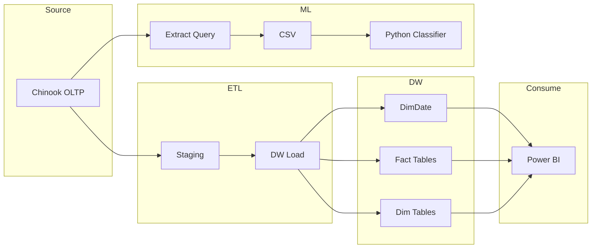

# Music Sellers Performance Analytics — DW, ML & Viz


> A star/snowflake data warehouse built from the Chinook OLTP database, paired with ML-based employee sales performance classification and Power BI dashboards.

[Architecture](#architecture) · [Quick Start](#quick-start) · [Project Structure](#project-structure) · [Documentation](#documentation)

---

## Overview

### Problem Statement

> Music retailers need a single source of truth for sales, customers, and catalog—while leadership wants data-driven insights into employee sales performance. The Chinook OLTP database supports transactions but not analytics. There is no unified view for BI or predictive analytics on seller performance.

### Solution

This project delivers **two integrated parts**:

1. **Part I — Data Warehouse:** A star/snowflake schema DW built from Chinook OLTP, with SQL Server ETL scripts and Power BI reporting.
2. **Part II — ML Analytics:** An employee sales performance classifier using feature engineering, K-fold cross-validation, and hyperparameter tuning.

The result is a **single repository** that supports data warehouse design, ETL, ML pipelines, and BI visualization.

### Key Features

| Feature | Description |
|---------|-------------|
| **Star/Snowflake schema** | Dimensional model for analytics; conformed dimensions |
| **Full ETL pipeline** | OLTP → Staging → DW; SQL Server scripts |
| **DimDate** | Date dimension for time-based analysis |
| **ML classification** | Employee performance (High/Average/Low) from revenue metrics |
| **K-fold cross-validation** | Robust model evaluation |
| **Power BI dashboard** | DW-based visualizations |
| **Presentation** | Methodology, findings, recommendations |

### Target Audience

- **Data engineers** — ETL, DW design, SQL
- **Data scientists / ML engineers** — Classification pipeline, feature engineering
- **Business analysts** — Power BI dashboards, KPIs
- **Stakeholders** — Presentation and recommendations

---

## Architecture

### High-Level Architecture



### Data Flow

| Stage | Description | Artifacts |
|-------|-------------|-----------|
| **OLTP** | Chinook source schema | `sql/oltp/db_oltp.sql` |
| **Staging** | Raw copy, initial cleansing | `sql/staging/staging.sql`, `staging_update.sql` |
| **DW** | Star/snowflake model; DimDate; load | `sql/dw/dw_create_tables.sql`, `dw_dim_Date.sql`, `dw_load_data_tables.sql` |
| **ML Extraction** | Employee + Invoice + Customer joins | `sql/ml/employee_joins_aggregated.sql`, `add_gender_column.sql` |
| **ML Pipeline** | Preprocessing, classification, evaluation | `src/ml/employee_performance_classifier.py` |
| **Consumption** | Power BI dashboards | `assets/power_bi/power_bi_dashboard.pbix` |

### Tech Stack

| Component | Technology |
|-----------|------------|
| **Database** | SQL Server |
| **ETL** | TSQL scripts |
| **Data model** | Star/Snowflake schema |
| **ML** | Python (pandas, scikit-learn) |
| **BI** | Power BI |
| **Languages** | TSQL 98.7%, Python 1.3% |

### System Requirements

- **SQL Server** 2019 or later (or compatible)
- **Python** 3.8+
- **Power BI Desktop** (for dashboard)
- **Libraries:** pandas, scikit-learn, pyodbc (or sqlalchemy)

---

## Data Model

### Layers

| Layer | Purpose | Location |
|-------|---------|----------|
| **OLTP** | Source schema (Chinook) | `sql/oltp/` |
| **Staging** | Raw landing, light transform | `sql/staging/` |
| **DW** | Dimensional model, DimDate | `sql/dw/` |
| **ML** | Extraction queries for classification | `sql/ml/` |

### Key Entities

- **DimDate** — Date dimension for time-based analysis
- **Fact tables** — Sales, invoices (star schema)
- **Dimension tables** — Customer, Product, Employee
- **ML dataset** — Employee-level aggregates (revenue, invoices, tenure)

### ML Business Logic

- **Performance labels:** High / Average / Low Performer based on total revenue per employee
- **Features:** Tenure, invoice count, average revenue per customer, etc.
- **Classification:** Spot-check (Decision Tree, Random Forest, SVM, Logistic Regression) → K-fold CV → hyperparameter tuning

---

## Project Structure

```
music-sellers-performance-analytics-ml-data-warehouse-viz/
├── sql/
│   ├── oltp/                 # Chinook source schema
│   │   └── db_oltp.sql
│   ├── staging/              # Staging tables & load
│   │   ├── staging.sql
│   │   └── staging_update.sql
│   ├── dw/                   # Dimensional model
│   │   ├── dw_create_tables.sql
│   │   ├── dw_dim_Date.sql
│   │   └── dw_load_data_tables.sql
│   └── ml/                   # ML extraction queries
│       ├── employee_joins_aggregated.sql
│       └── add_gender_column.sql
├── src/
│   └── ml/
│       └── employee_performance_classifier.py
├── data/
│   └── raw/
│       └── employee_joins_aggregated.csv
├── docs/
│   ├── architecture/
│   │   ├── dw_erd_schema.png
│   │   └── dw_star_schema.png
│   └── figures/              # ML report figures
├── assets/
│   ├── dw/
│   │   └── dw_backup.bak
│   ├── power_bi/
│   │   ├── power_bi_dashboard.pbix
│   │   └── dashboard_theme.json
│   └── presentation/
│       ├── Project_Future_Chinook_Presentation.pdf
│       └── Project_Future_Chinook_Presentation.pptx
└── README.md
```

### Folder Descriptions

| Folder | Purpose |
|--------|---------|
| `sql/oltp/` | Chinook OLTP DDL; source reference |
| `sql/staging/` | Staging table DDL and load scripts |
| `sql/dw/` | DW DDL, DimDate, load procedures |
| `sql/ml/` | SQL for ML feature extraction |
| `src/ml/` | Python ML pipeline (preprocessing, classification, evaluation) |
| `data/raw/` | Extracted CSV for ML (employee aggregates) |
| `docs/architecture/` | ERD, star schema diagrams |
| `docs/figures/` | ML analysis and report figures |
| `assets/dw/` | SQL Server backup of loaded DW |
| `assets/power_bi/` | Power BI report and theme |
| `assets/presentation/` | Project presentation (PDF, PPTX) |

---

## Getting Started

### Prerequisites

- SQL Server 2019+ (or Azure SQL)
- Python 3.8+
- Power BI Desktop (optional, for dashboard)
- Git

### Installation

```bash
# Clone
git clone https://github.com/Konstant-gk/music-sellers-performance-analytics-ml-data-warehouse-viz.git
cd music-sellers-performance-analytics-ml-data-warehouse-viz

# Python environment
python -m venv .venv
.venv\Scripts\activate   # Windows
# source .venv/bin/activate  # Linux/Mac

# Dependencies (if requirements.txt exists)
pip install pandas scikit-learn pyodbc
```

### Configuration

For the **ML pipeline**, ensure the CSV path in `src/ml/employee_performance_classifier.py` points to `data/raw/employee_joins_aggregated.csv` (or your exported file).

For **SQL Server** scripts, update connection details in your environment. Do not commit credentials.

### Quick Start

#### Part I — Data Warehouse

1. **Create OLTP database** — Run `sql/oltp/db_oltp.sql` to create Chinook source (if not already present).
2. **Create DW** — Run `sql/dw/dw_create_tables.sql` and `sql/dw/dw_dim_Date.sql`.
3. **Load staging** — Run `sql/staging/staging.sql`.
4. **Load DW** — Run `sql/dw/dw_load_data_tables.sql`.
5. **Restore backup (optional)** — Use `assets/dw/dw_backup.bak` to restore a pre-loaded DW.

#### Part II — ML Pipeline

1. **Extract data** — Run `sql/ml/employee_joins_aggregated.sql` against your DW or OLTP; export to CSV.
2. **Run classifier** — Execute `src/ml/employee_performance_classifier.py`.

```bash
python src/ml/employee_performance_classifier.py
```

3. **Open Power BI** — Use `assets/power_bi/power_bi_dashboard.pbix`; connect to your DW.

---

## Usage

### Running the ETL Pipeline

Execute SQL scripts in order:

1. `sql/oltp/db_oltp.sql` — OLTP
2. `sql/staging/staging.sql` — Staging
3. `sql/dw/dw_create_tables.sql` — DW schema
4. `sql/dw/dw_dim_Date.sql` — DimDate
5. `sql/dw/dw_load_data_tables.sql` — Load facts and dimensions

### Running the ML Pipeline

```bash
python src/ml/employee_performance_classifier.py
```

The script loads the CSV, preprocesses, engineers features, defines performance labels, and runs classification with K-fold CV and hyperparameter tuning.

### Power BI

1. Open `assets/power_bi/power_bi_dashboard.pbix`.
2. Update the data source connection to your DW.
3. Refresh visuals.

---

## Data Quality

- **DW:** Schema integrity enforced by DDL; DimDate populated by script
- **ML:** Feature validation in Python; performance labels derived from revenue quantiles
- **Classification:** K-fold cross-validation; confusion matrix and precision/recall/F1 evaluation

---

## Documentation

| Resource | Description |
|----------|-------------|
| [docs/architecture/](docs/architecture/) | ERD, star schema diagrams |
| [docs/figures/](docs/figures/) | ML analysis figures |
| [assets/presentation/](assets/presentation/) | Project presentation (methodology, findings, recommendations) |

---

## Contributing

1. Fork the repository
2. Create a branch (`feat/`, `fix/`, `docs/`)
3. Open a Pull Request

---

## License

MIT — see [LICENSE](LICENSE) if present.

---

## Contact

- **Repository:** [Konstant-gk/music-sellers-performance-analytics-ml-data-warehouse-viz](https://github.com/Konstant-gk/music-sellers-performance-analytics-ml-data-warehouse-viz)
- **Issues:** [GitHub Issues](https://github.com/Konstant-gk/music-sellers-performance-analytics-ml-data-warehouse-viz/issues)
